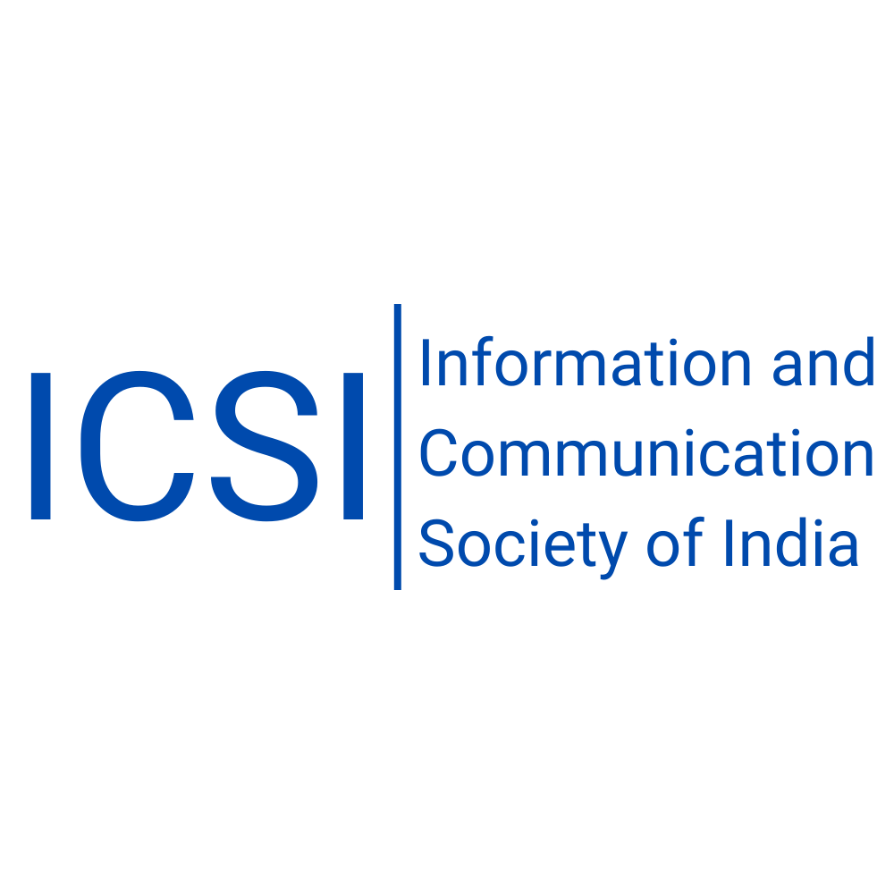

[//]: # ()

[//]: # ()

[//]: # ()

[//]: # ()

## About ICSI

The **Information and Communication Society of India (ICSI)** is a registered professional society based in New Delhi,
India, and a signatory of the Lyon Declaration on Access to Information and Development.

### Aims and Objectives

- To collect and disseminate relevant knowledge on information and communication.
- To initiate projects, studies, surveys, and data analysis.
- To provide editorial and technical support for publications.
- To impart training on information and communication technologies.
- To promote automation, networking, and advanced ICT applications.
- To liaise with national and international organizations.

## Research and Professional Activities

ICSI has undertaken several research projects, including:

- **Growth of Scientific Periodicals in India (1948-2000)**
- **Growth of Scientific Societies in India: 1784-1947**
- **Indian Library and Information Science Abstracts (ILSA)** (Multiple volumes covering different years)
- **Max Mueller Bhavan Project - Libraries and Sources of Information in India**
- **Annotated Bibliography of Rare Books at the Central Secretariat Library**
- **National Forests Commission Report, 2006**

## Events Organized

ICSI has hosted lectures and seminars, including:

- **Prof. B. Guha Memorial Lectures** on Data Diplomacy and National Education Policy.
- **Seminar on Commercialization of Knowledge** at India International Centre, New Delhi.

## Membership

ICSI offers **Life Membership** (INR 1000) and **Institutional Membership** (INR 20,000). Members include professionals
in information science, communication, and social media.

## Contact Us

**Information and Communication Society of India (ICSI)**  
80, Shivalik Apartments, Alaknanda, New Delhi – 110019, India  
📞 +91-9999020157  
📧 icsi.president[at]gmail.com  
🐦 [Twitter/X: @IndiaICSI](https://twitter.com/IndiaICSI)  
🌐 [Website](http://icsi-in.blogspot.com)

## License

This project is open-source under the [MIT license](https://opensource.org/licenses/MIT).

